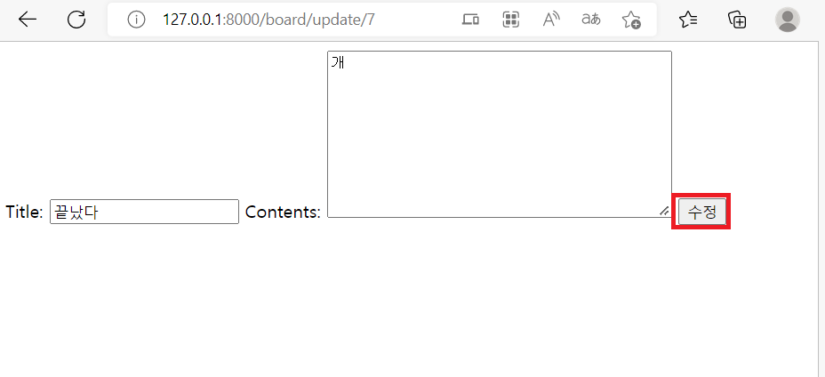
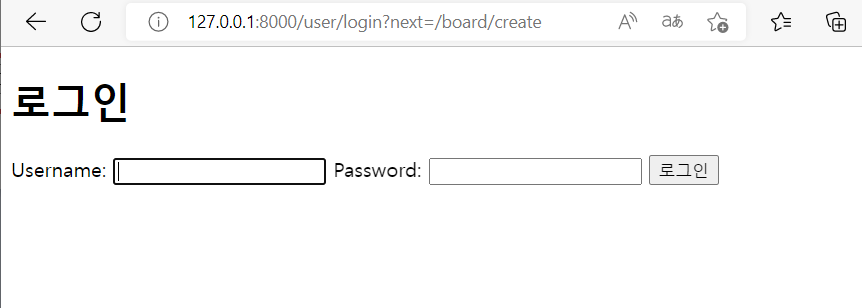
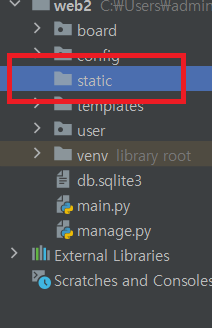

# CRUD
## DB연결(가상머신)
1. 방화벽 해제
```shell
systemctl stop firewalld
systemctl disable firewalld
setenforce 0
```
2. mysql 설치 및 초기 설정
```shell
yum install -y mysql-server

systemctl restart mysqld

mysql_secure_installation 

mysql -u root -p #mysql접속
```

```sql
CREATE DATABASE blog;
CREATE USER 'kjh'@'%' IDENTIFIED BY 'qwer1234';
GRANT ALL PRIVILEGES ON blog.* TO 'kjh'@'%';
FLUSH PRIVILEGES;
EXIT;
```
3. 확인
<br/>
<br/>

4. Django와 연결<br/>
` config/settings.py `
```python
# DATABASES 내용 지우고 추가
DATABASES = {
    'default': {
        'ENGINE': 'django.db.backends.mysql',
        'NAME': 'blog',
        'USER': 'kjh',
        'PASSWORD': 'qwer1234',
        'HOST': '192.168.197.50',
        'PORT': '3306',
        'OPTIONS': {
            'init_command': 'SET sql_mode="STRICT_TRANS_TABLES"'
        }
    }
}
```

```shell
pip install mysqlclient

python manage.py migrate
```
<br/>


5. Django와 DB연결 확인<br/>
<br/>
내가 생성한 DB에 Django의 테이블이 생성된걸 확인 할 수 있다.<br/>

6. 테이블 생성해보기(연습)<br/>
```shell
django-admin startapp board # 앱폴더 생성
```
` board/models.py `에 다음 명령어 추가<br/>
```python
from django.db import models

class Fruits(models.Model):
    name = models.CharField(max_length=50)
    descript = models.TextField()
    price = models.FloatField()
    quantity = models.IntegerField()
    cdate = models.DateTimeField(auto_now_add=True)

    def __str__(self):
        return 'id : {},name : {},description : {}'.format(self.id, self.name, self.descript)
```
<br/>

` config/settings.py`에 앱 추가.<br/>
```python
INSTALLED_APPS = [
    'django.contrib.admin',
    'django.contrib.auth',
    'django.contrib.contenttypes',
    'django.contrib.sessions',
    'django.contrib.messages',
    'django.contrib.staticfiles',
    'board',    # 여기 추가
]
```
<br/>
- 테이블 적용<br/>
```shell
python manage.py makemigrations board # 앱 이름
python manage.py migrate
```
- 확인
<br/>

## 게시판 만들기
### DB에 게시판 테이블 생성
` board/models.py `에 다음 명령어 추가<br/>
```python
class Board(models.Model):
    title = models.CharField(max_length=200)
    contents = models.TextField()
    create_date = models.DateTimeField(auto_now_add=True)
    def __str__(self): return self.title
```
- 적용<br/>
```shell
python manage.py makemigrations board # 앱 이름
python manage.py migrate
```
<br/>

2. 모델폼 생성
- 앱폴더(board)에 `forms.py`생성<br/>
<br/>

- 폼 작성<br/>
```python
from django import forms
from .models import Board

class BoardForm(forms.ModelForm):
    class Meta:
        model = Board
        fields = ('title', 'contents')
```

## 게시판 Create 만들기
- 앱폴더에 ` board/views.py `
```python
from board.forms import BoardForm
from django.shortcuts import redirect

def create(request):
    if request.method == "GET":
        boardForm = BoardForm()
        return render(request, 'board/create.html', {'boardForm' : boardForm})
    else:
        boardForm = BoardForm(request.POST)

        if boardForm.is_valid():
            board = boardForm.save(commit=False)
            board.save()
            return redirect('/board/list/')
```

- config 폴더에 `urls.py`
```python
import board.views


urlpatterns = [
    path('board/create', board.views.create), #추가
]
```

- templates 폴더에 `create.html`작성<br/>
```html
<body>
<form method="POST">
  
  {{ boardForm }}
  <input type="submit" value="작성">
</form>
</body>
```

- 확인<br/>
<br/>

## 게시판 List 만들기
 - 앱폴더에 ` board/views.py `
```python
def list(request):
    posts = Board.objects.all().order_by('-id')

    return render(request, 'board/list.html', {'posts': posts})
```

- config 폴더에 `urls.py`
```python
    path('board/list/', board.views.list), #추가
```
- templates 폴더에 `list.html`작성<br/>
```html
<body>
    <table>
        <thead>
            <th>글 번호</th>
            <th>제목</th>
            <th>작성일시</th>
        </thead>

        
            
                <tr>
                    <td>{{ post.id }}</td>
                    <td>{{ post.title }}</td>
                    <td>{{ post.create_date }}</td>
                </tr>
            
        
    </table>
</body>
```

- 확인<br/>
<br/>


## 게시판 Read 만들기
- 앱폴더에 ` board/views.py `
```python
def read(request, num):
    post = Board.objects.get(Q(id=num))

    return render(request, 'board/read.html', {'post':post})
```

- config 폴더에 `urls.py`
```python
    path('board/read/<int:num>', board.views.read), #추가
```

- templates 폴더에 `read.html`작성<br/>
```html
<table>
        <thead>
            <th>글 번호</th>
            <th>제목</th>
            <th>작성일시</th>
        </thead>

        

                <tr>
                    <td>{{ post.id }}</td>
                    <td>{{ post.title }}</td>
                    <td>{{ post.contents }}</td>
                    <td>{{ post.create_date }}</td>
                </tr>

        
    </table>
```

- 확인<br/>
<br/>

## 게시판 Delete 만들기
- 앱폴더에 ` board/views.py `
```python
def delete(request, num):
    post = Board.objects.get(Q(id=num))
    post.delete()
    return redirect('/board/list/')
```
- config 폴더에 `urls.py`
```python
    path('board/delete/<int:num>', board.views.delete), #추가
```

## 게시판 Update 만들기
- 앱폴더에 ` board/views.py `
```python
def update(request, num):
    post = Board.objects.get(Q(id=num))
    if request.method == 'GET':
        boardForm = BoardForm(instance = post)
        return render(request, 'board/update.html', {"boardForm":boardForm})
    else:
        boardForm = BoardForm(request.POST)

        if boardForm.is_valid():
            post.title = boardForm.cleaned_data['title']
            post.contents = boardForm.cleaned_data['contents']
            post.save()
            return redirect("/board/read/"+str(post.id))
```
- config 폴더에 `urls.py`
```python
    path('board/update/<int:num>', board.views.update),
```
- templates 폴더에 `update.html`작성<br/>
```html
<form method="post">
  
  {{ boardForm }}
  <button>수정</button>
</form>
```
- 확인<br/>
<br/>
<br/>
<br/>


## 사용자 관리
- 사용자 관리 앱 만들기
```shell
python manage.py startapp user
```
### 회원가입
- 앱폴더 ` user/views.py `
```python
from django.contrib.auth.forms import UserCreationForm, AuthenticationForm
from django.shortcuts import render, redirect


def signup(request):
    if request.method == 'POST':
        signupForm = UserCreationForm(request.POST)

        if signupForm.is_valid():
            signupForm.save()
            return redirect('/user/login')
    else:
        signupForm = UserCreationForm()
    return render(request, 'user/signup.html', {'signupForm':signupForm})

```

- config 폴더에 `urls.py`
```python
import user.views
urlpatterns = [
    path('user/signup/', user.views.signup),    # 추가
]
```

- templates 폴더에 `user/signup.html`생성<br/>
```html
<body>
<h1>회원가입</h1>

<form method="POST">
    
    {{ signupForm }}
    <input type="submit" name="Submit"/>
</form>
</body>
```

- 확인<br/>
<br/>
<br/>

### 로그인
- 앱폴더 ` user/views.py `
```python
from django.contrib.auth import login as auth_login


def login(request):
    if request.method == 'POST':
        loginForm = AuthenticationForm(request, request.POST)

        if loginForm.is_valid():
            auth_login(request, loginForm.get_user())
            return redirect('/board/list/')
        else:
            return redirect('/user/login')
    else:
        loginForm = AuthenticationForm()

    return render(request, 'user/login.html', {'loginForm':loginForm})
```

- config 폴더에 `urls.py`
```python
    path('user/login', user.views.login),   # 추가
```

- templates 폴더에 `user/signup.html`생성<br/>
```html
<body>
<h1>로그인</h1>
<form method="POST">
  
  {{ loginForm }}
  <input type="submit" value="로그인"/>
</form>
</body>
```

- 확인<br/>
<br/>
<br/>

### 로그아웃
- 앱폴더 ` user/views.py `
```python
from django.contrib.auth import logout as auth_logout


def logout(request):
    auth_logout(request)
    return redirect('/user/login')
```
- config 폴더에 `urls.py`
```python
    path('user/logout', user.views.logout), # 추가
```

- 확인
<br/>
<br/>

## 게시판에 사용자 관리 적용하기
- 모델 수정
`board/models.py` 수정하기
```python
class Board(models.Model):
    writer = models.ForeignKey(User, on_delete=models.CASCADE)  # 추가
    title = models.CharField(max_length=200)
    contents = models.TextField()
    create_date = models.DateTimeField(auto_now_add=True)
    def __str__(self): return self.title    # 수정
```
- 마이그레이션
```shell
python manage.py makemigrations board
```
<br/>
픽스 메세지가 뜬다. 왜냐하면 기존 board DB에 사용자 정보가 없기 때문이다. <br/>
1번 옵션을 선택, 그 다음 1번을 한번 더 입력해 비어있는 board DB에 1번 사용자를 채워준다.<br/>

``` shell
python manage.py migrate
```

### 로그인을 해야 접근 가능하게 만들기

- 앱폴더에 ` board/views.py `
```python
from django.contrib.auth.decorators import login_required   # 추가


@login_required(login_url='/user/login')    # 추가
```
<br/>

- 확인<br/>
<br/>
<br/>
create에 접속하려고 하면 로그인 페이지로 이동된다. update와 delete에도 다음 설정을 해준다.<br/>

### 회원만 게시글 작성하게 만들기
- 앱폴더에 ` board/views.py `
```python
@login_required(login_url='/user/login')
def create(request):
    if request.method == "GET":
        boardForm = BoardForm()
        return render(request, 'board/create.html', {'boardForm' : boardForm})
    else:
        boardForm = BoardForm(request.POST)

        if boardForm.is_valid():
            board = boardForm.save(commit=False)
            board.writer = request.user # 추가
            board.save()
            return redirect('/board/list')
```

- 확인<br/>
<br/>
<br/>

### 게시글에 작성자도 출력
- templates 폴더에 `board/list.html`수정<br/>
```html
<body>
    <table>
        <thead>
            <th>글 번호</th>
            <th>제목</th>
            <th>작성자</th>
            <th>작성일시</th>   <!--추가-->
        </thead>

        
            
                <tr>
                    <td>{{ post.id }}</td>
                    <td>{{ post.title }}</td>
                    <td>{{ post.writer }}</td>  <!--추가-->
                    <td>{{ post.create_date }}</td>
                </tr>
            
        
    </table>
</body>
```

- 확인<br/>
<br/>

### 사용자 수정, 삭제
- templates 폴더에 `board/list.html`수정<br/>
```html
<body>
    <table>
        <thead>
            <th>글 번호</th>
            <th>제목</th>
            <th>작성자</th>
            <th>작성일시</th>
        </thead>

        
            
                <tr>
                    <td>{{ post.id }}</td>
                    <td>{{ post.title }}</td>
                    <td>{{ post.writer }}</td>
                    <td>{{ post.create_date }}</td>
                </tr>
<!------------------------------여기부터--------------------------------------->
                <tr>
                    
                    <td><a href="/board/update/{{post.id}}">
                        <button>수정</button>
                    </a></td>
                    <td><a href="/board/delete/{{post.id}}">
                        <button>삭제</button>
                    </a></td>
                    
                    <td><a href="/board/list/">
                        <button>목록</button>
                    </a></td>
                </tr>
<!------------------------------여기까지 추가--------------------------------------->

            
        
    </table>
</body>
</html>
```

- 앱폴더에 ` board/views.py `
```python
@login_required(login_url='/user/login')
def update(request, num):
    post = Board.objects.get(Q(id=num))

    # 추가 ------------------------
    if request.user != post.writer:
        return redirect('/board/list/')
    # ----------------------------
    if request.method == 'GET':
        boardForm = BoardForm(instance = post)
        return render(request, 'board/update.html', {"boardForm":boardForm})
    else:
        boardForm = BoardForm(request.POST)

        if boardForm.is_valid():
            post.title = boardForm.cleaned_data['title']
            post.contents = boardForm.cleaned_data['contents']
            post.save()
            return redirect("/board/read/"+str(post.id))
```
로그인한 사용자와 게시글 사용자의 아이디가 일치하지 않으면 작업을 수행하지 않고 리다이렉트하게 만든다.<br/>
- 확인<br/>
<br/>

## 템플릿 관리

` config/settings.py ` 에 설정을 바꾼다.
```python
STATIC_URL = '/static/'
STATICFILES_DIRS = [
    BASE_DIR / 'static',
]
```
<br/>

- 프로젝트 디렉토리 안에 static디렉토리 생성<br/>
<br/>