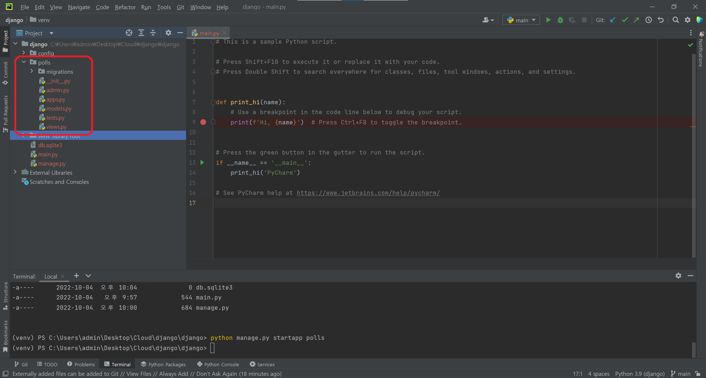
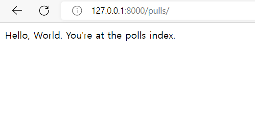
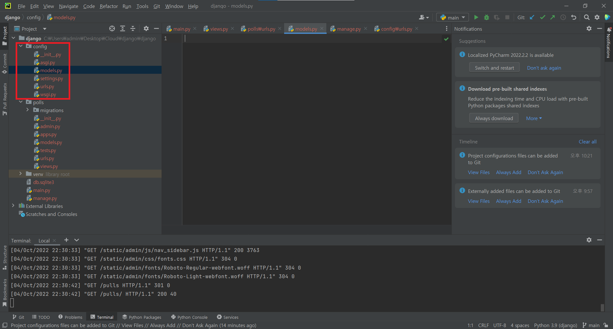
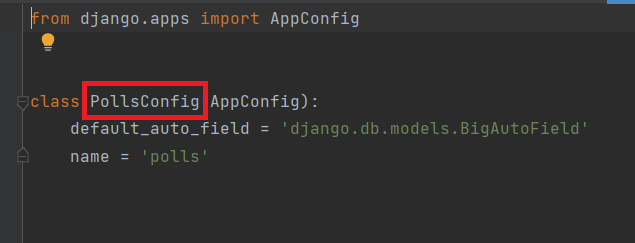
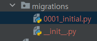

# 투표 어플리케이션 만들기
## 폴더 생성
```python
python manage.py startapp polls
```
<br/>

## Views

### 기본 페이지 만들기
- polls/view.py
```python
from django.shortcuts import render
from django.http import HttpResponse


def index(request):
    return HttpResponse("Hello, World. You're at the polls index.")
```
http 리퀘스트가 오면 `Hello, World. You're at the polls index.`을 화면에 출력한다.<br/>

### url 연결하기
- polls/urls.py 생성 후<br/>
```python
from django.urls import path

from . import views

urlpatterns = [
    path('', views.index, name='index'),
]
```

- config/urls.py
```python
from django.contrib import admin
from django.urls import path, include # 기본에서 include를 추가해야 한다.

urlpatterns = [
    path('admin/', admin.site.urls),
    path('pulls/', include('polls.urls')),
]
```
설정 후 서버를 실행시켜 기본 url 뒤에 `pulls`를 추가 해보면<br/>
<br/>

`polls/view.py`가 불러와진다.


## Models

### 모델 파일 생성
<br/>

- polls/models.py
```python
from django.db import models

class Question(models.Model):
    question_text = models.CharField(max_length=200)
    pub_date = models.DateTimeField('date published')

class Choice(models.Model):
    question = models.ForeignKey(Question, on_delete=models.CASCADE)
    choice_text = models.CharField(max_length=200)
    votes = models.IntegerField(default=0)
```
- `Question`이라는 모델을 생성
    - `question_text` : 최대길이 200의 문자열을 저장 할 수 있는 변수 생성, 질문내용을 받을 변수
    - `pub_date` : 발행 날짜를 저장 할 수 있는 변수 생성

- `Choice`
    - `question` : 위에 있는 `Question` 모델과 외래키로 연결
    - `choice_text` : 최대길이 200의 문자열을 저장 할 수 있는 변수 생성, 선택 내용을 받을 변수
    - `votes` : 정수형값을 저장 할 수 있는 변수, 이곳에 투표번호를 저장한다.
<br/><br/><br/>

### 모델을 어플리케이션에 연결
어플리케이션에 연결을 하려면 polls의 APP이름을 알아야 한다.<br/>
`polls/apps.py`에 들어가 APP이름을 확인 한다.<br/>
<br/>
APP이름이 `PollsConfig`인걸 확인 할 수 있다. 이제 이 APP을 Django 폴더에 연결해줘야 한다.<br/>


- config/sattings.py
```python
INSTALLED_APPS = [
    'polls.apps.PollsConfig', #pulls의 app 추가
    'django.contrib.admin',
    'django.contrib.auth',
    'django.contrib.contenttypes',
    'django.contrib.sessions',
    'django.contrib.messages',
    'django.contrib.staticfiles',
]
```
### Migration
마이그레이션이란, 모델의 변경 내역을 DB 스키마에 적용시키는 방법이다.<br/>

```python
python manage.py makemigrations polls #어플리케이션의 모델에 대한 변화를 기록해준다.
```
<br/>
마이그레이션에 성공하면 0001_initial.py라는 파일이 생성된다.<br/>

```python
python manage.py migrate #어플리케이션의 모델에 대한 변화를 반영해준다.
```


