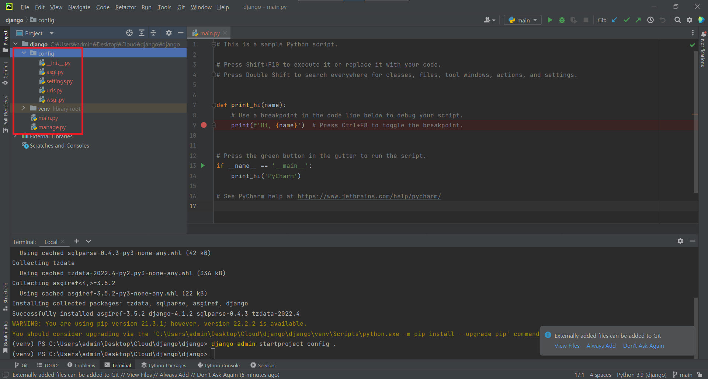
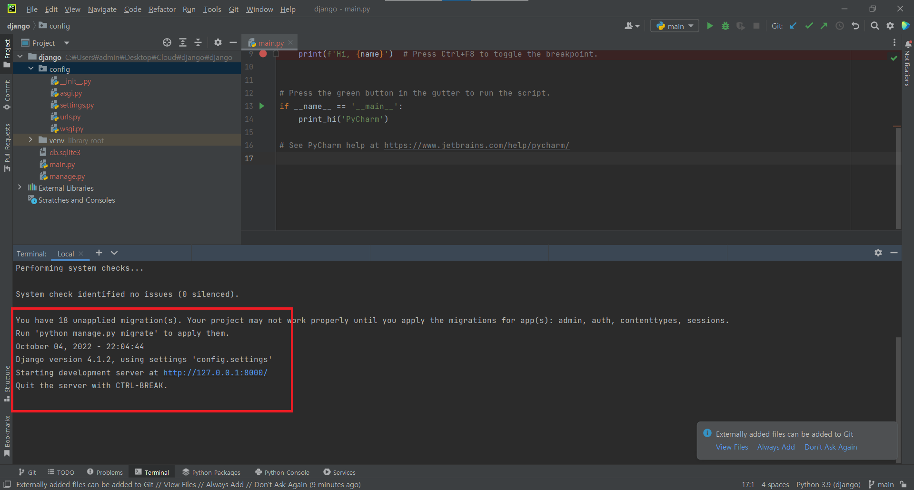
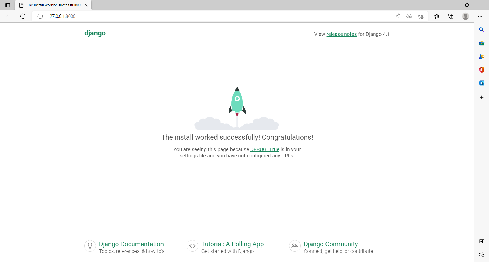

# Django
## 환경구성
- 설치
```python
pip install django
django-admin startproject config . #현재폴더에 프로젝트 구성
django-admin startproject [프로젝트 이름] #프로젝트 폴더 생성
```

<br/>

다음과 같이 기본 작업 환경이 생성된다.<br/>

- 서버 시작해 보기
```python
python manage.py runserver
```
<br/>
<br/>

Django의 기본구성이 끝났다. 이제 여러가지 기능을 넣어 나만의 웹서버를 만들면 된다.<br/>

## 패키지 저장
```shell
pip freeze > requirements.txt
```

## 시크릿 키
내가 만든 장고 프로젝트 중에 남에게 노출하기 민감한 정보들이 있을 경우가 많다.<br/> 
그런 정보들을 따로 보관해 깃허브에 커밋할때 같이 업로드 되지 못하게 막을 필요가 있다.<br/>

