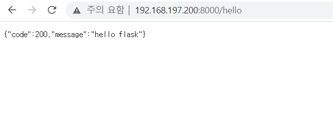

# nginx
## 설치
### nginx 설치
```shell
# 방화벽 해제
systemctl stop firewalld
systemctl disable firewalld
setenforce 0

# nginx 설치
yum install -y nginx
# nginx 실행
systemctl restart nginx
```
### python, flask 설치
```shell
yum install -y python3-pip python3-devel gcc
alias python=python3
alias pip=pip3

pip install virtualenv
pip install flask flask_cors
```
### 사용자 생성
```shell
useradd -m user
usermod -a -G user nginx

```
### flask 실행
```shell
cd /home/user/
chmod 750 user
vi main.py
```
`main.py`
```python
from flask import Flask
from flask_cors import CORS

app = Flask(__name__)
cors = CORS(app, resources={r"/*": {"origins": "*"}})

@app.route("/hello")
def hello():
    result = {"code" : 200, "message":"hello flask"}
    return result

if __name__ == "__main__":
    app.run(host='0.0.0.0', port=1111)
```

```shell
python main.py
```


### gunicorn 설치및 실행
```shell
pip install gunicorn
cd /home/user/
gunicorn --bind 0.0.0.0:8000 wsgi:app
```
<br/>

- 서비스 등록
```shell
vi /etc/systemd/system/backend.service
```
```
[Unit]
Description=Gunicorn Service
After=network.target

[Service]
User=user
Group=user
WorkingDirectory=/home/user/
ExecStart=/usr/local/bin/gunicorn --workers 1 --bind unix:backend.sock -m 007 wsgi:app

[Install]
WantedBy=multi-user.target
```
```shell
systemctl daemon-reload
systemctl restart backend
```

### nginx와 gunicorn연동
```shell
vi /etc/nginx/conf.d/default.conf
```
```conf
server {
    listen 80;
    server_name IP주소;

    location / {
        proxy_set_header Host $http_host;
        proxy_set_header X-Real-IP $remote_addr;
        proxy_set_header X-Forwarded-For $proxy_add_x_forwarded_for;
        proxy_set_header X-Forwarded-Proto $scheme;
        proxy_pass http://unix:/home/user/backend.sock;
    }
}
```
```shell
systemctl restart nginx
```
<br/>