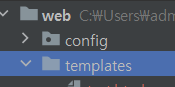
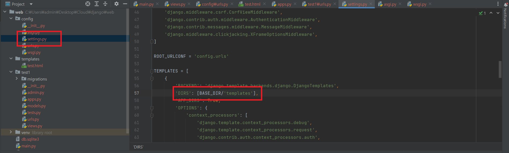
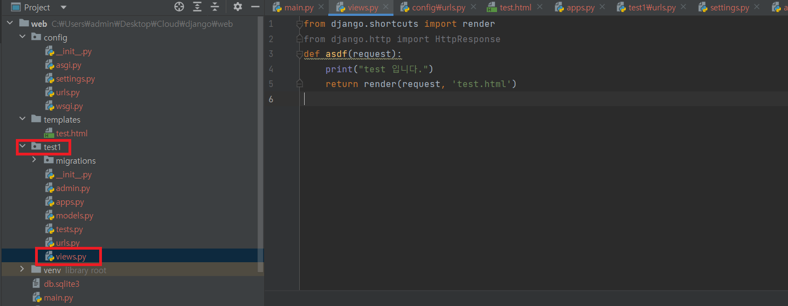
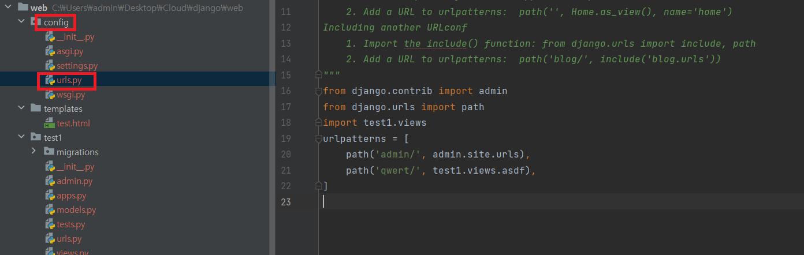
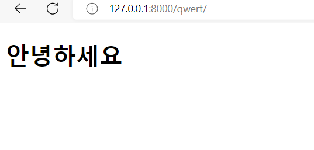

# web
## Html Django에 연결하기

- templates 생성<br/>
<br/>
프로젝트 파일 밑에 templates 디렉토리를 생성하고 html파일 하나를 만든다.<br/>
```html
<!DOCTYPE html>
<html lang="en">
<head>
    <meta charset="UTF-8">
    <title>Title</title>
</head>
<body>
    <h1>안녕하세요</h1>
</body>
</html>
```

- templates 적용
<br/>
`config` 디렉토리 밑에 있는 `settings.py`의 설정을 다음과 같이 바꿔준다.<br/>
```python
TEMPLATES = [
    {
        'BACKEND': 'django.template.backends.django.DjangoTemplates',
        'DIRS': [BASE_DIR/'templates'], # 여기 추가
        'APP_DIRS': True,
        'OPTIONS': {
            'context_processors': [
                'django.template.context_processors.debug',
                'django.template.context_processors.request',
                'django.contrib.auth.context_processors.auth',
                'django.contrib.messages.context_processors.messages',
            ],
        },
    },
]
```

- 앱 수정<br/>
만들어 놓은 앱 폴더에 `view.py`를 다음과 같이 작성한다.<br/>
<br/>
```python
def asdf(request):
    print("test 입니다.")
    return render(request, 'test.html')
```

- 앱 연결하기<br/>
<br/>
`config`디렉토리 안에 있는 `urls.py`에 들어가 설정을 바꿔준다.<br/>
```python
from django.contrib import admin
from django.urls import path
import test1.views
urlpatterns = [
    path('admin/', admin.site.urls),
    path('qwert/', test1.views.asdf), # 여기 추가
]
```

- 실행
```shell
python manage.py runserver
```
<br/>

## 클라이언트 서버 데이터 주고 받기
